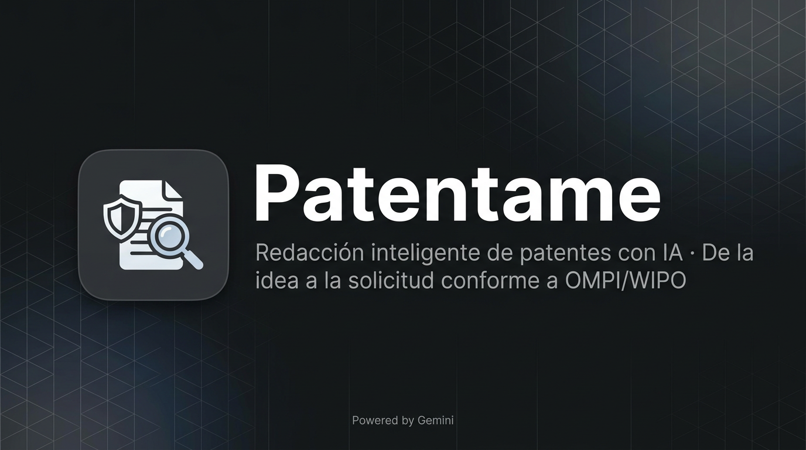

<p align="center">
  
</p>

<p align="center">
  <strong>Patentame</strong> — La ruta más directa desde la idea hasta la solicitud de patente
</p>

<p align="center">
  <em>Ecosistema integrado de redacción asistida por IA, vigilancia tecnológica y análisis de estado del arte. Diseñado para gestores tecnológicos que priorizan la agilidad sin comprometer el rigor formal.</em>
</p>

<p align="center">
  
  
  
  
  
</p>

<p align="center">
  <a href="https://ai.studio/apps/drive/1DxYjkYkgfUHX9_brDGF_SHYIyJ82pSCX">▶️ Probar en Google AI Studio</a> ·
  <a href="#-instalación">Instalación</a> ·
  <a href="#-skill-vigilancia-tecnológica">Skill VT</a> ·
  <a href="#-scripts">Scripts</a>
</p>

---

## Por qué Patentame importa para el gestor tecnológico

En un contexto donde la innovación se mide en ciclos cortos y la ventaja competitiva depende de cómo se protege el conocimiento, **Patentame** ofrece una respuesta concreta: reduce la fricción entre la invención y su formalización legal. No sustituye al agente de patentes ni al asesor jurídico; los potencia. Permite que equipos de I+D, oficinas de transferencia y gestores de PI lleguen a la mesa de redacción con borradores sólidos, alineados con directrices OMPI/WIPO, y con el contexto de vigilancia tecnológica ya integrado.

El ecosistema está pensado para tres momentos clave: **redactar** (Patentame), **analizar y vigilar** (skill portable en IA), y **automatizar procesos** (scripts Python). Juntos forman un flujo que escala desde el inventor individual hasta la organización con múltiples proyectos en cartera.

---

## Componentes del ecosistema

| Componente | Propósito estratégico |
|------------|------------------------|
| **Patentame** | Redacción guiada de solicitudes de patentes y modelos de utilidad. Reduce tiempo de borrador y mejora la consistencia con estándares internacionales. |
| **Skill VT** | Agente especializado en análisis de patentes, vigilancia tecnológica e inteligencia competitiva. Funciona en Claude, ChatGPT, Gemini y Cursor. |
| **Scripts Python** | Plantillas ejecutables para procesos de vigilancia tecnológica y planes de búsqueda. Sirven como base documental para equipos y auditorías. |

---

## 🚀 Patentame — Aplicación web

Patentame guía al usuario paso a paso en la redacción de cada sección de la solicitud. La IA sugiere borradores a partir de documentos subidos (estado de la técnica, memoria técnica) y refina textos para acercarlos a las expectativas de las oficinas de patentes. El resultado: un documento coherente, con checklist WIPO integrado, listo para revisión experta y exportación.

### Qué ofrece al equipo

| Capacidad | Valor para el gestor |
|-----------|----------------------|
| **Wizard guiado** | Estructura predefinida que evita omisiones y asegura coherencia entre secciones. |
| **IA predictiva** | Primer borrador en minutos; el equipo se centra en refinar, no en partir de cero. |
| **Mejora con IA** | Ajuste de tono, precisión y adherencia a WIPO sin ciclos infinitos de corrección manual. |
| **Multilingüe** | Soporte ES/EN para proyectos con proyección internacional. |
| **Checklist WIPO** | Control de calidad antes de enviar a agente o oficina. |
| **Exportación PDF** | Entrega inmediata para presentación o archivado. |

### Instalación

**Requisitos:** Node.js 18+ · API Key de [Google AI Studio](https://aistudio.google.com/apikey)

```bash
git clone https://github.com/scientificbroker/Patentame.git
cd Patentame
npm install --legacy-peer-deps
```

Crear `.env.local`:
```
GEMINI_API_KEY=tu_clave_aqui
```

```bash
npm run dev
```

→ Aplicación en `http://localhost:3000`

> `--legacy-peer-deps` es necesario por incompatibilidad de peer dependencies. La aplicación opera correctamente.

### Estructura del proyecto

```
Patentame/
├── App.tsx              # Flujo principal del wizard
├── components/          # SectionInput, iconos
├── data/                # i18n (ES/EN)
├── services/            # geminiService (integración Gemini)
├── types.ts
└── vite.config.ts
```

---

## 🧠 Skill — Vigilancia tecnológica

Un gestor tecnológico necesita respuestas rápidas sobre el panorama competitivo, el estado del arte y la libertad de operación. El skill de **patentes y vigilancia tecnológica** convierte a cualquier asistente de IA (Claude, ChatGPT, Gemini, Cursor) en un consultor especializado: analiza patentes, propone estrategias de búsqueda, estructura informes de vigilancia y mantiene un glosario técnico coherente. Se integra como instrucciones de sistema; no requiere infraestructura adicional.

### Casos de uso típicos

- Análisis de documentos de patentes y solicitudes
- Búsqueda de estado del arte y antecedentes
- Vigilancia tecnológica e inteligencia competitiva
- Interpretación de reivindicaciones y cobertura legal
- Estrategias de propiedad intelectual
- Gestión de información tecnológica (GIT)

### Integración por plataforma

| Plataforma | Integración |
|------------|-------------|
| **Claude** | Project settings → Custom instructions → pegar `SKILL.md` |
| **ChatGPT** | Custom Instructions o GPT personalizado → pegar `SKILL.md` |
| **Gemini** | System instruction → pegar `SKILL.md` |
| **Cursor** | Copiar `patentes-vigilancia-tecnologica` a `~/.cursor/skills/` |
| **Otros LLM** | Incluir contenido como prompt de sistema |

El skill se encuentra en `patentes-vigilancia-tecnologica/SKILL.md`.

---

## ⚙️ Scripts

Para procesos repetibles y auditoría, los scripts generan documentos estructurados que sirven como base de trabajo o evidencia interna.

### generar_proceso_vt.py

Documento de proceso de Vigilancia Tecnológica en 5 fases: definición de necesidades, selección de fuentes, recolección, análisis y difusión. Pensado para equipos que necesitan formalizar su metodología de VT.

```bash
python scripts/generar_proceso_vt.py --interactivo
python scripts/generar_proceso_vt.py -s "Energía solar" -o "Tendencias en almacenamiento" -S proceso_vt.md
```

| Parámetro | Descripción |
|-----------|-------------|
| `-s, --sector` | Sector o ámbito tecnológico |
| `-o, --objetivo` | Objetivo principal |
| `-t, --tecnologias` | Tecnologías clave |
| `-c, --competidores` | Competidores a vigilar |
| `-r, --regiones` | Regiones/jurisdicciones |
| `-S, --salida` | Archivo de salida |

### generar_plan_busqueda.py

Plan de búsqueda de patentes con términos, clasificaciones IPC/CPC y estrategia de consulta. Útil antes de iniciar una ronda de vigilancia o un análisis FTO.

```bash
python scripts/generar_plan_busqueda.py --interactivo
python scripts/generar_plan_busqueda.py -t "IoT industrial" -S plan_busqueda.md
```

| Parámetro | Descripción |
|-----------|-------------|
| `-t, --tecnologia` | Tecnología o ámbito |
| `-o, --objetivo` | Objetivo de la búsqueda |
| `-S, --salida` | Archivo de salida |

Scripts ubicados en `patentes-vigilancia-tecnologica/scripts/`. Requieren **Python 3.9+** y solo usan biblioteca estándar.

---

## 📚 Referencia rápida

### Fuentes oficiales de patentes

| Región | Fuente |
|--------|--------|
| Europa | [Espacenet](https://worldwide.espacenet.com), [EPO](https://www.epo.org), [OEPM](https://www.oepm.es) |
| España | [OEPM](https://www.oepm.es) |
| Estados Unidos | [USPTO](https://patft.uspto.gov), [Google Patents](https://patents.google.com) |
| Internacional (PCT) | [Patentscope](https://patentscope.wipo.int) |
| Latinoamérica | INPI, IMPI, INAPI |

### Glosario esencial

| Término | Definición |
|---------|------------|
| **FTO** | Freedom to Operate — libertad para explotar sin infringir |
| **IPC/CPC** | Clasificación Internacional/Cooperativa de Patentes |
| **Prior art** | Antecedente o estado del arte relevante |
| **Reivindicación** | Declaración que define el ámbito de protección |
| **PCT** | Tratado de Cooperación en materia de Patentes |

### Ciclo de vigilancia tecnológica

1. **Definición de necesidades** — Tecnologías, competidores, tendencias a vigilar
2. **Selección de fuentes** — Patentes, publicaciones, normativa
3. **Recolección** — Búsquedas periódicas y alertas configuradas
4. **Análisis** — Patrones, oportunidades y riesgos
5. **Difusión** — Informes y recomendaciones a decisores

---

## 🚢 Despliegue

```bash
npm run build
npm run preview   # Vista previa del build
```

---

## ⚠️ Advertencia legal

Herramienta con fines **educativos y de orientación**. No constituye asesoría legal ni garantiza derechos de patente. Los archivos subidos se procesan de forma temporal y no se almacenan. Para decisiones de propiedad intelectual, consulte a un agente de patentes o abogado especializado.

---

## 👤 Créditos

Desarrollado por **[@scientificbroker](https://github.com/scientificbroker)** — Proyecto Open Source
